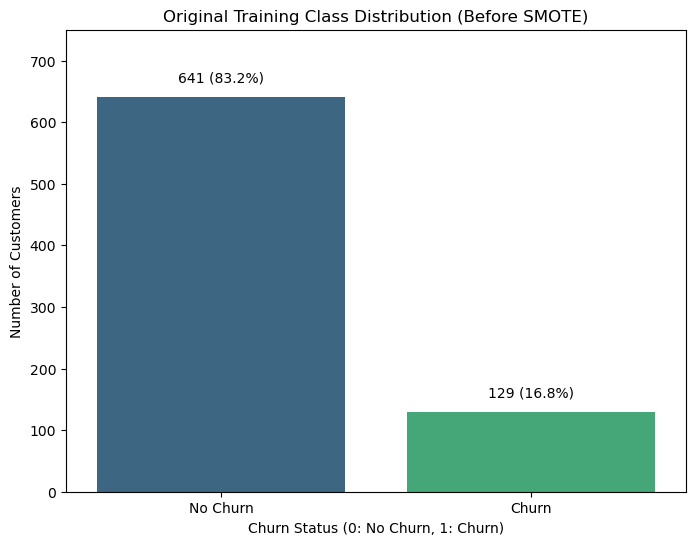
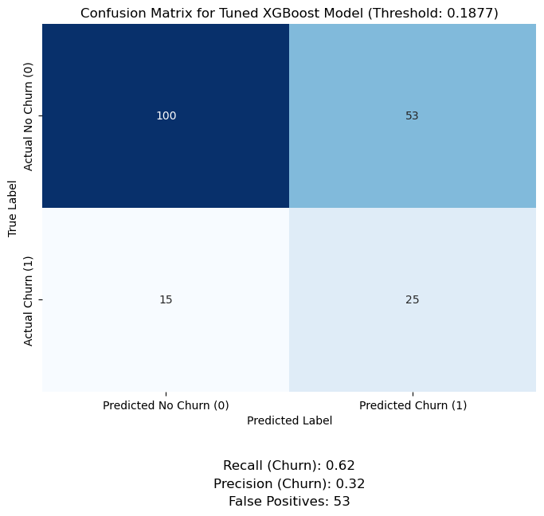
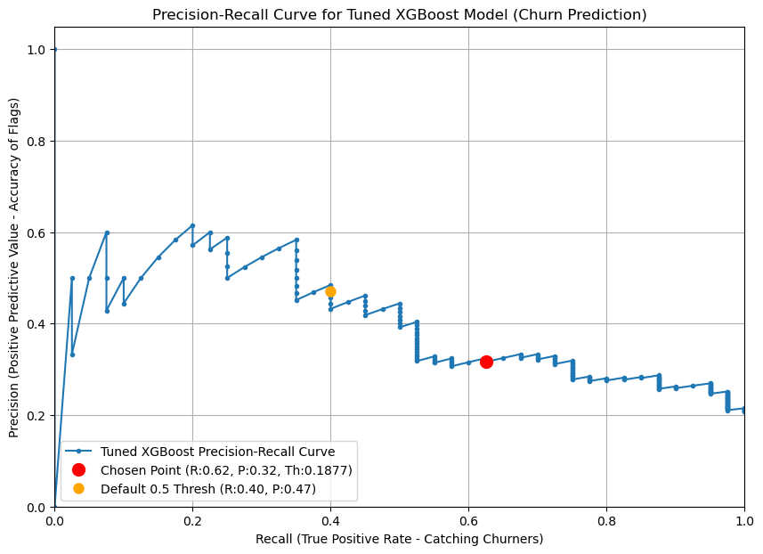
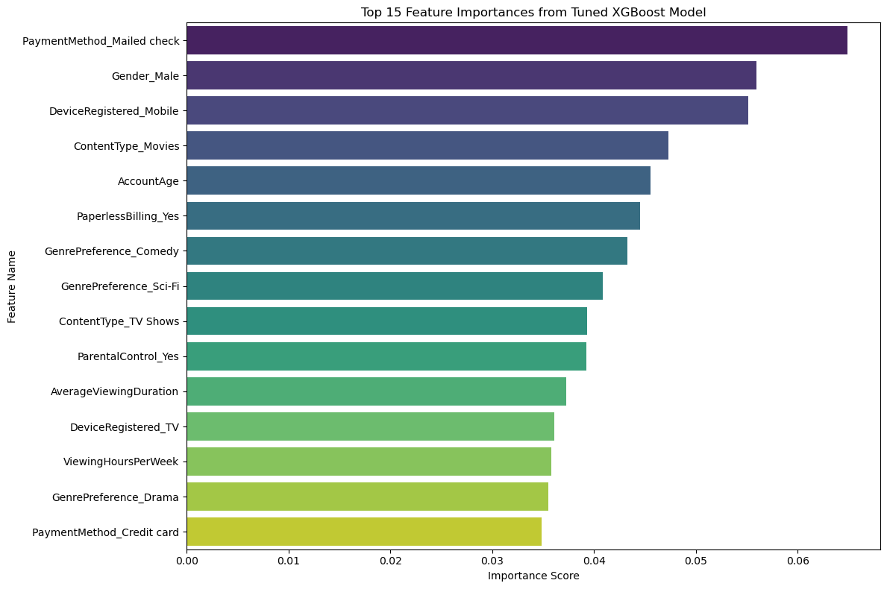

# **Customer Churn Prediction Project: Proactive Retention Strategy**

## **Executive Summary**

This project delivers a robust machine learning model to predict customer churn for a subscription service, enabling proactive retention efforts. Through rigorous data preprocessing, advanced **XGBoost modeling**, and a careful analysis of model trade-offs (Precision vs. Recall), a **Tuned XGBoost Model** has been developed.

Operating at a strategically chosen probability threshold of **0.1877**, this model effectively identifies approximately **62% of actual churners (Recall)** while ensuring that **32% of its "at-risk" predictions are genuinely correct (Precision)**. This pragmatic balance minimizes wasted resource expenditure on false alarms, offering a highly actionable and cost-effective approach to churn prevention.

---

## **1. ASK: Problem Definition & Objectives**

**Problem:** Customer churn leads to significant revenue loss and reduced customer lifetime value for subscription services. Early identification of at-risk customers is crucial for implementing targeted retention strategies.

**Objective:** To build a predictive system that identifies customers likely to churn *before* they actually leave, allowing for proactive intervention. The target variable is `Churn` (binary: 1 for churn, 0 for no churn).

---

## **2. PREPARE: Data Gathering & Inspection**

**Data Source:** `subscription_Service_Churn_Dataset.csv` (Simulated customer behavior data).

**Initial Inspection Highlight:**
A severe class imbalance was identified in the `Churn` target variable (approx. 83.2% 'No Churn' vs. 16.8% 'Churn' in the training set). This imbalance necessitated specialized handling to prevent model bias.

**Key Libraries:** `pandas`, `warnings`, `matplotlib.pyplot`, `seaborn`, `sklearn`, `imblearn`, `xgboost`, `numpy`.

---

## **3. PROCESS: Data Cleaning, Transformation & Balancing**

**A. Data Cleaning:**
* `TotalCharges` converted to numeric, handling initial inconsistencies.
* Missing numerical values imputed with the **median**.
* Missing categorical values imputed with the **mode**.
* `CustomerID` and `Subtitles Enabled` columns dropped (identifier/excessive missing values).

**B. Feature Transformation:**
* **Categorical Encoding:** One-Hot Encoding (`pd.get_dummies` with `drop_first=True`) applied to all categorical features (e.g., `Gender`, `Contract`, `InternetService`).
* **Numerical Scaling:** `StandardScaler` applied to numerical features (e.g., `AccountAge`, `MonthlyCharges`) to normalize their range, crucial for many ML algorithms.

**C. Class Imbalance Handling (SMOTE):**
* Applied **Synthetic Minority Over-sampling Technique (SMOTE)** exclusively to the **training data** to generate synthetic examples of the minority 'Churn' class. This balanced the dataset for effective model learning while ensuring an unbiased evaluation on the untouched test set.

---

## **4. ANALYZE: Model Building, Tuning & Evaluation**

**A. Data Splitting:**
* The processed dataset was split into **80% training** and **20% testing** sets (`train_test_split`) *before* any model training or SMOTE application, ensuring an unbiased final evaluation.

**B. Model Building & Comparison:**
* **Baseline (Logistic Regression):** Initial performance on imbalanced data showed very poor recall for churners, even after SMOTE it highlighted a clear Precision-Recall trade-off.
* **Advanced Model (XGBoost):** Chosen for its high performance on tabular data and ability to capture complex non-linear relationships, aiming for a better balance of Precision and Recall.

**C. Hyperparameter Tuning:**
* Extensive tuning performed on the Tuned XGBoost Model using **GridSearchCV** with **5-fold cross-validation** on the SMOTE-resampled training data.
* **Optimal Hyperparameters Found:** `{'colsample_bytree': 0.8, 'learning_rate': 0.1, 'max_depth': 7, 'n_estimators': 100, 'subsample': 0.8}` (yielding a strong cross-validation F1-score of 0.8938 on training data).

**D. Evaluation & Trade-off Analysis:**
* Model performance was rigorously evaluated on the **completely unseen test data**.
* Crucially, the **Precision-Recall Curve** was analyzed to understand the inherent trade-off: increasing Recall (catching more churners) often decreases Precision (more false alarms). This analysis guided the selection of an optimal operating point.

**E. Optimal Operating Point Selection:**
* Based on business goals (balancing churn detection with efficient resource allocation), a probability threshold of **0.1877** was chosen. This threshold optimizes for a practical balance, delivering **62% Recall** and **32% Precision**.

---

## **5. SHARE: Visualizations & Key Findings**

Below are key visualizations generated to effectively convey the project's insights and model performance. All images are located in the `images/` directory within this repository.

#### **Visualization: Original Training Class Distribution (Before SMOTE)**
Purpose: To visually demonstrate the severe class imbalance in the original dataset, explaining why specialized techniques like SMOTE were necessary.
Insight: Clearly shows that 'No Churn' customers significantly outnumber 'Churn' customers, which would bias a model if not addressed.



#### **Visualization: Confusion Matrix for Tuned XGBoost Model (Threshold: 0.1877)**
Purpose: To clearly present the model's performance at the chosen operational threshold (0.1877), showing the count of True Positives (25), False Positives (53), False Negatives (15), and True Negatives (100).
Insight: Directly quantifies how many churners are caught (True Positives), how many are missed (False Negatives), and how many false alarms occur (False Positives), illustrating the precise trade-offs chosen for the business strategy.



#### **Visualization: Precision-Recall Curve for Tuned XGBoost Model (Churn Prediction)**
Purpose: To visually explain the critical trade-off between Recall and Precision, justifying the chosen operating point based on business priorities.
Insight: Shows that while higher recall is possible, it comes with a steep drop in precision (more false positives), emphasizing the strategic balance chosen for efficient resource allocation. The chosen operating point (Recall: 0.62, Precision: 0.32, Threshold: 0.1877) and other thresholds are clearly marked on this curve.



#### **Visualization: Top 15 Feature Importances from Tuned XGBoost Model**
Purpose: To identify the most influential factors the XGBoost model used to predict churn, providing actionable insights into potential root causes.
Insight: Helps direct business efforts towards specific customer attributes or service aspects (e.g., `PaymentMethod_Mailed check`, `Gender_Male`, `DeviceRegistered_Mobile`, `ContentType_Movies`, `AccountAge`) that are highly correlated with churn.



---

## **6. ACT: Implementation & Monitoring (Business Strategy)**

**A. Model Deployment:**
The trained Tuned XGBoost model would be serialized and integrated into the company's operational systems (e.g., CRM, marketing automation platform) for automated, real-time churn risk prediction on new customer data.

**B. Strategy Implementation (Tiered Intervention):**
Customers would be segmented into distinct risk tiers based on churn probability scores and the chosen **0.1877 threshold**.
* **High Risk (e.g., churn probability &gt; 0.40):** Aggressive, personalized interventions (direct calls, significant discounts).
* **Moderate Risk (e.g., churn probability 0.1877 - 0.40):** Automated, medium-cost interventions (targeted emails with offers, proactive service outreach). This tier aligns with our chosen operational balance.
* **Monitor/Low Risk (e.g., churn probability &lt; 0.1877):** Passive monitoring or inclusion in general engagement campaigns.

**C. Continuous Monitoring & Refinement:**
* Regularly track model performance against actual churn to ensure consistency.
* Monitor data drift (changes in customer behavior) to detect model degradation.
* Establish **A/B testing protocols** to systematically test the effectiveness of different retention offers and communication channels, ensuring ongoing optimization and adaptation to evolving customer behavior.

---

## **Skills Demonstrated**

This project showcases a comprehensive skill set essential for a modern data analyst/scientist:

* **Problem Definition & Business Acumen:** Translating business challenges (churn) into data science problems and interpreting results in a business context.
* **Data Acquisition & Preparation:** Handling raw data, cleaning, transforming, and preparing it for modeling, including handling missing values and data type inconsistencies.
* **Feature Engineering/Transformation:** Creating new features (implicitly through one-hot encoding) and employing encoding/scaling techniques.
* **Imbalanced Data Handling:** Expert application of SMOTE to address a common, critical data challenge.
* **Machine Learning Modeling:** Proficiency in building, training, and evaluating supervised classification models (Logistic Regression, XGBoost).
* **Hyperparameter Optimization:** Skilled use of GridSearchCV for robust model tuning.
* **Model Evaluation:** Deep understanding and application of key metrics (Accuracy, Precision, Recall, F1-Score, Confusion Matrix) and crucial trade-off analysis.
* **Data Visualization & Communication:** Effectively conveying complex insights through visual means.

---

## **How to Run This Project**

To replicate and explore this project:

1.  **Clone the Repository:**
    ```bash
    git clone [https://github.com/Abdullah88909/Customer-Churn-Prediction.git](https://github.com/Abdullah88909/Customer-Churn-Prediction.git)
    cd Customer-Churn-Prediction
    ```
2.  **Install Dependencies:**
    ```bash
    pip install -r requirements.txt
    ```
3.  **Open the Jupyter Notebook:**
    ```bash
    jupyter notebook Customer_Churn_Pred__ML_Mod.ipynb
    ```
    (Ensure `jupyter` is installed. If not, `pip install jupyterlab` or `pip install notebook`)
---